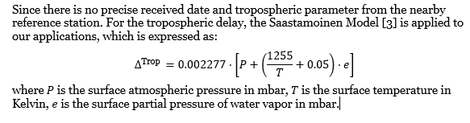

# AAE6102-Assignment (2021-10-31)

## Intorduction

The aim of the assessment is to using the least-squares (LS) approach to solve the receiver location. 
The raw measuremnt is an 8x7 matrix containing raw ranging information as rcvr.dat
The ephemeris data is an 8 x 24 matrix as eph.dat

## Instructions
1. Download 'lib' and 'code' folders
   - download the zip file and extract to desired folder
   - add the 'lib' into the matlab path 
2. Open file 'Main_code.m' in MATLAB
3. Press 'Run'

## Code Explanation
The code can be divided into two main part. 
1. The first part is to solve the satellites’ ECEF position.
2. The second partis using LS method to solve the receiver position and clock offset
3. The flowchart is as follows, 

##  Results
### Satellite position
The calculated satellite ECEF position,
| PRN | ECEF-X          | ECEF-Y          | ECEF-Z          |
| --- | --------------- | --------------- | --------------- |
| 5   | \-8855590.1672  | \-22060119.2187 | \-11922092.5929 |
| 6   | \-8087227.5011  | \-16945963.6246 | 18816194.5085   |
| 10  | 9027647.7954    | \-12319231.9190 | 21737387.5983   |
| 17  | \-21277121.3279 | \-7467118.2902  | 14287503.4518   |
| 22  | \-13649526.7151 | 8229509.8280    | 21122958.5266   |
| 23  | \-19452319.3838 | \-16750376.1484 | \-6918520.6419  |
| 26  | 6162910.8881    | \-25286774.4834 | \-3541190.2681  |
| 30  | \-17713898.7737 | \-19797466.2847 | 19209.1324      |

The satellites’ ECEF-positions in the geographic map are shown in follows

### Satellite clock error
The code phase offset and satellite clock error
| PRN | code phase offset (s) | satellite clock error (m) |
| --- | --------------------- | ------------------------- |
| 5   | 1.8907E-04            | 56680.48                  |
| 6   | \-8.3932E-08          | \-25.1623                 |
| 10  | 3.3248E-05            | 9967.388                  |
| 17  | \-2.0490E-04          | \-61428.3                 |
| 22  | 2.2268E-04            | 66757.21                  |
| 23  | 1.0360E-05            | 3105.913                  |
| 26  | 2.8099E-04            | 84239.63                  |
| 30  | \-1.0041E-05          | \-3010.26                 |

### Satellite tropospheric delay 

| PRN | tropospheric delay (m) |
| --- | ---------------------- |
| 5   | 11.653                 |
| 6   | 2.464                  |
| 10  | 4.846                  |
| 17  | 3.180                  |
| 22  | 8.513                  |
| 23  | 6.329                  |
| 26  | 9.660                  |
| 30  | 3.659                  |

### User Location

The geometry of satellites

The geometry of satellites

The
